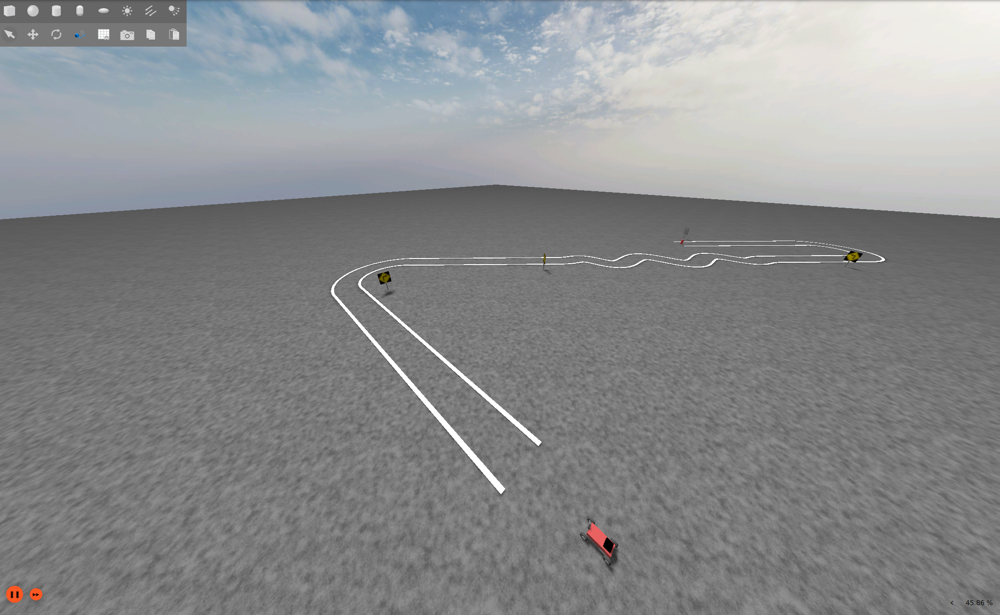
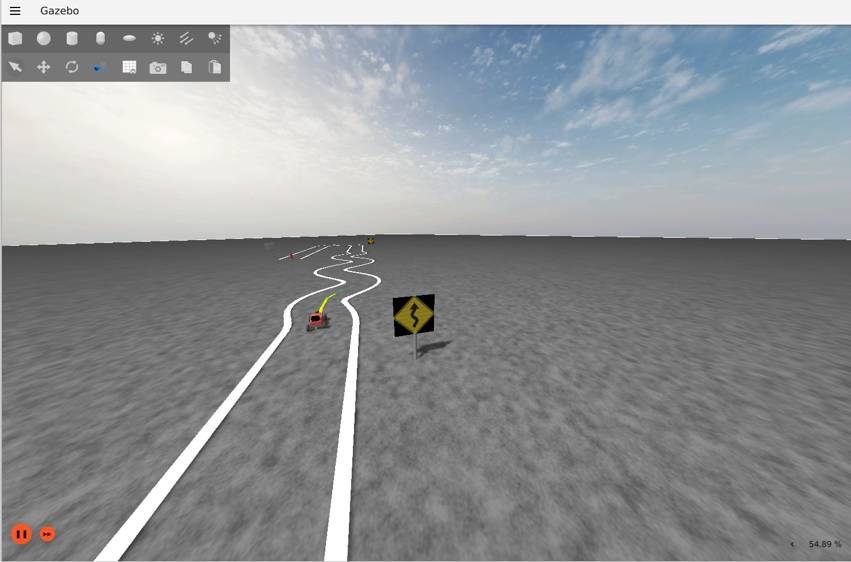
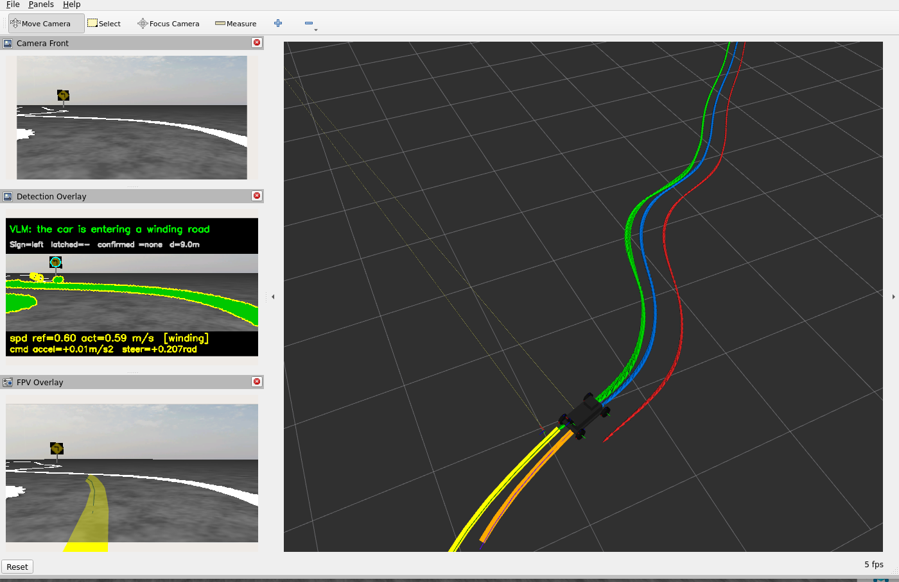

# VLM-MPC Robot Car — Simulation Demo

**A small-scale autonomous-vehicle demo: a self-driving car that finds the
lane with classic computer vision, reads roadside traffic signs with a
vision-language model, and drives with a real Model Predictive Controller —
entirely in simulation.**

<!-- TODO: replace with a real screenshot (keep the filename, or update the link) -->


## Overview

This demo puts a small self-driving car on a closed course in **Gazebo
Fortress** and lets it drive a full lap on its own — a compact testbed for the
same problems full-scale autonomous vehicles have to solve. The track has
everything a tiny self-driving car could wish for: an S-curve, a tight winding
section, a U-turn, and roadside traffic signs — **left**, **right**, **winding
road**, and **STOP**.

Under the hood, the car runs a compact version of a real autonomous-driving
stack:

- **Perception** — an OpenCV planner reads the front RGBD camera, extracts the
  lane markings, and publishes a metric centerline path (`/vlm_path_odom`).
- **Control** — a C++ **Model Predictive Controller** (linearized bicycle
  model, real QP solved with **OSQP**) tracks that path and drives the car
  (`/cmd_vel`).
- **Localization** — wheel odometry + a noisy IMU fused by an EKF
  (`robot_localization`) → `/odom_ekf`.
- **Sign reading (optional)** — a **Qwen2.5-VL** vision-language model reads
  the roadside signs; a maneuver state machine latches each sign in odom and
  feeds a speed setpoint to the MPC, so the car slows for the turns and the
  winding section — and halts at the STOP sign.

<!-- TODO: replace both placeholders with real screenshots -->
| Gazebo — simulation world | RViz — what the robot sees |
|:---:|:---:|
|  |  |
| *The car approaching a traffic sign on the track* | *Planned centerline, tracked path, and the FPV camera with detection overlay* |

See [docs/ARCHITECTURE.md](docs/ARCHITECTURE.md) for the full node graph.

## Tech stack

| Layer | Technology |
|---|---|
| Robot middleware | **ROS 2 Humble** on Ubuntu 22.04 (native or WSL2) |
| Simulation | **Gazebo Fortress** + `ros_gz` bridge; URDF/Xacro robot model with Ackermann steering, RGBD camera and IMU plugins |
| Perception | **Python 3** with **OpenCV** + **NumPy** — lane-marking extraction and metric centerline fitting |
| Control | **C++17** MPC — linearized bicycle model, quadratic program solved by **OSQP** |
| Localization | **robot_localization** EKF fusing wheel odometry and IMU |
| Vision-language model | **Qwen2.5-VL-3B** (4-bit quantized) via **PyTorch (CUDA)**, **Hugging Face Transformers**, and **bitsandbytes** — fits a 6 GB consumer GPU |
| Visualization | **RViz2** (paths, TF, FPV detection overlay) + in-scene path ribbon markers |
| Build & tooling | `colcon`, **tmux** demo launcher, frame capture and a record/analyze debug toolkit |

## Requirements

- **Ubuntu 22.04** — native, or WSL2 on Windows 11 (that's where this project
  was developed; WSL notes are covered in the docs)
- ROS 2 **Humble** + Gazebo **Fortress** (installed by the script below)
- No GPU needed for the default demo. The optional VLM sign reader needs an
  NVIDIA GPU with **~6 GB VRAM**.

## Quickstart

```bash
# 1. Clone (any target directory works)
git clone -b demo <REPO_URL> vlm_robot_demo
cd vlm_robot_demo

# 2. Install dependencies (ROS 2 Humble, Gazebo Fortress, tmux, OSQP from source)
./scripts/setup/install_deps.sh

# 3. Environment (add both lines to ~/.bashrc to make them permanent)
export LIBGL_ALWAYS_SOFTWARE=1        # REQUIRED on WSL2, harmless elsewhere
source /opt/ros/humble/setup.bash

# 4. Build
colcon build --symlink-install

# 5. Run the demo
./scripts/start_path_demo.sh
```

A new terminal window opens with a 4×2 **tmux** grid — one pane per component
(Gazebo, EKF, MPC, RViz, frame capture, planner, VLM slot, free shell). The
panes start on a staggered schedule; after **~40 s** the car starts following
the lane. Watch the Gazebo window (3rd-person) and RViz (paths, FPV camera
with detection overlay).

**Shutdown:** close the demo terminal window, or run
`tmux kill-session -t vlm_robot_demo`.

## Demo modes

| Command | Behavior |
|---|---|
| `./scripts/start_path_demo.sh` | Default: OpenCV lane following at cruise speed. No GPU, no VLM. |
| `VLM_SIGN=1 ./scripts/start_path_demo.sh` | Full pipeline: Qwen reads the signs; the car slows for turns/winding and **stops at the STOP sign**. Needs the VLM venv (`scripts/setup/setup_vlm_venv.sh`) + ~6 GB VRAM. |
| `MANUAL_DRIVE=1 ./scripts/start_path_demo.sh` | MPC off; drive yourself with the keyboard in pane 8 (`w/s` speed, `a/d` steer, space = stop). |

More toggles: `VLM_QUERY=0` (start the sign node with querying paused),
`RECORD_SESSION=1` (pane 7 records a debugkit session instead of sitting idle
— see [Recording & analysis](#recording--analysis) below).

Standalone tool (not part of the tmux grid): with the sim running, `python3
scripts/capture_frame.py --interval 1.0` saves camera frames to `captures/`
for offline inspection — run it manually in any free pane.

## Recording & analysis

The `debugkit` toolchain records a run's ROS topics and turns them into a
metrics report — useful for checking tracking error, oscillation, or sign
timing after a drive:

```bash
# while the demo is running, in another terminal:
./scripts/record_session.sh --preset core --label baseline

# after stopping the recording (Ctrl-C):
./scripts/analyze_session.sh latest
```

The analyzer writes `report.md`, `metrics.json`, and diagnostic plots (lane
detection, tracking error, speed tracking, oscillation) to the session's
output directory — no ROS or GPU needed, pure NumPy/Matplotlib. See
[docs/technical_report.md §9](docs/technical_report.md#9-test-and-analyze-infrastructure)
for how it's used to validate the stack.

## Packages

| Package | Language | Role |
|---|---|---|
| `robotcar_description` | URDF/Xacro | Robot model: Ackermann steering, RGBD camera, IMU, ground-truth odometry plugins |
| `robotcar_gazebo` | SDF/Python | `track_lines` world, sign models, Gazebo + bridge + spawn launch |
| `vlm_planner_py` | Python | OpenCV centerline planner (`vlm_node`), sign latch + maneuver FSM, Qwen sign reader (`vlm_sign_node`) |
| `mpc_tracker_cpp` | C++ | MPC tracker (OSQP QP), path relay |
| `robotcar_localization` | — | EKF bringup (`robot_localization` `ekf_node` + `ekf.yaml`) |
| `robot_bringup` | — | ROS↔Gazebo bridge config, RViz config + launch |
| `robotcar_utils_py` | Python | Cone/track markers, odom re-zero, FPV overlay, keyboard teleop |
| `robotcar_utils_cpp` | C++ | In-scene path ribbon (`path_marker_node`) |

## Documentation

- **[docs/INSTALL.md](docs/INSTALL.md)** — full installation guide (manual steps, WSL2 notes, optional VLM setup)
- **[docs/ARCHITECTURE.md](docs/ARCHITECTURE.md)** — node graph, topics, how the planner / MPC / sign pipeline work
- **[docs/TROUBLESHOOTING.md](docs/TROUBLESHOOTING.md)** — known issues and fixes (read this first if something doesn't start)
- **[docs/technical_report.md](docs/technical_report.md)** — full write-up: design rationale, the VLM geometry-vs-symbols finding, the MPC formulation, and quantitative validation results

## License

Apache-2.0 — see [LICENSE](LICENSE).
