# VLM-Guided Model Predictive Control for an Ackermann Vehicle: A Hybrid Semantic–Geometric Autonomy Stack in Simulation

**Ke Fan** — 2026-07-15
*Technical report, `vlm_robot_demo` project (v1.0)*

---

## Abstract

This project demonstrates the design, implementation, and validation of a complete autonomous driving stack for a small Ackermann-steered vehicle in a ROS 2 / Gazebo Fortress simulation. The stack combines three layers with a deliberate division of labor: (i) a **classical geometric perception pipeline** that extracts a metric lane centerline from an RGB-D camera; (ii) a **vision-language model (VLM)** used exclusively for semantic perception — reading directional and stop signs — whose noisy per-frame outputs are converted into committed driving maneuvers by a unit-tested finite state machine; and (iii) a **linear model predictive controller (MPC)** solved as a quadratic program (QP) with OSQP that tracks the planned path and a maneuver-dependent speed setpoint. A central empirical finding is that small VLMs are unreliable at geometric tasks (waypoint generation, lane estimation) but effective at symbolic ones (sign classification), motivating the hybrid architecture. We further identify and fix a control limit cycle in which centimeter-level perception noise was amplified into steering oscillation, via a lookahead heading reference and control-rate (Δu) penalties. In the most recently recorded session, the full system completes a 50.7 m course with a signed right turn, a winding section, a terminal U-turn, and a sign-commanded stop, holding straight-line lateral tracking error to 0.2–0.5 cm (1σ) and whole-course path-tracking cross-track error to 0.018 m RMSE. We also describe the headless record–analyze–validate toolchain ("debugkit") and the scenario-based acceptance framework used to tune and regression-test the stack.

---

## 1. Introduction

Recent interest in applying large vision-language models to robot control raises a practical question for resource-constrained platforms: *what is a VLM actually good for in a driving stack?* This project answers the question empirically on a concrete system: a 1:10-scale-class Ackermann RC car simulated in Gazebo Fortress, with all compute on a single laptop GPU (NVIDIA RTX 3060, 6 GB VRAM) under WSL2.

The project evolved through experiment. Two negative results shaped the final architecture:

1. **VLMs failed at geometry.** SmolVLM2-500M could not produce usable lane waypoints or geometric descriptions from the driving camera; even its word-reading was unreliable. A classical OpenCV + depth-projection pipeline is strictly better at lane geometry at a fraction of the latency.
2. **VLMs succeeded at symbols.** Qwen2.5-VL-3B (4-bit quantized, 2.46 GB VRAM) reads symbolic traffic signs (left / right / winding / stop) reliably from the same camera — a task the classical pipeline has no natural mechanism for.

The resulting design principle — **"geometry is classical, semantics is the VLM"** — runs through the whole stack: the VLM never emits a path or a coordinate; it emits a *label*. Geometry (sign localization in the odometry frame, commit distances, maneuver entry/exit) is classical. The controller consumes only a path and a speed setpoint.

**Contributions.**

- A hybrid perception architecture separating a metric lane-centerline pipeline (HSV segmentation → depth projection → chain clustering → gate-walk centerline synthesis) from a decoupled, rate-limited VLM sign reader (§4, §5).
- A **maneuver state machine** that converts noisy, low-rate (≤1 Hz) sign labels into committed maneuvers using an odometry-latched sign position, an entry edge triggered when the sign board passes behind the vehicle, and a travel-distance-based straight-road release with engage/release hysteresis (§6).
- A linear time-varying MPC formulated as a sparse QP over a lateral/heading/speed error state, solved with OSQP at 30 Hz, with three reference-conditioning measures that eliminate a noise-amplifying limit cycle: a lookahead heading reference, Δu control-rate costs including the boundary term against the previously applied command, and linearization around the *current* speed with a slew-rate-limited speed setpoint (§8).
- A headless session recording and analysis toolchain — configurable topic capture, a fixed metric suite (drift, oscillation, sign-engagement latency, speed and cross-track tracking error), and node-internal debug taps for post-hoc perception inspection (§9).
- Quantitative validation: full-course completion including sign-commanded behaviors, 0.2–0.5 cm straight-line lateral error, and 0.018 m RMSE cross-track tracking over the whole course (§10).

**Figure 1 — System overview: photo/screenshot of the vehicle driving the track in Gazebo with the RViz FPV overlay.**

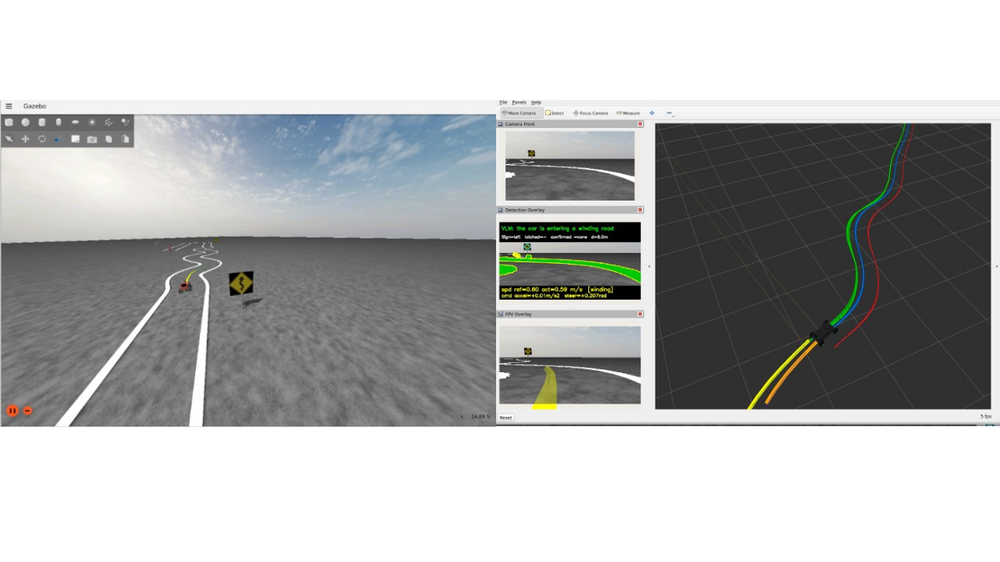

---

## 2. System Architecture

The stack is organized as three layers connected by ROS 2 topics (Fig. 2):

**Figure 2 — ROS2 system architecture.**

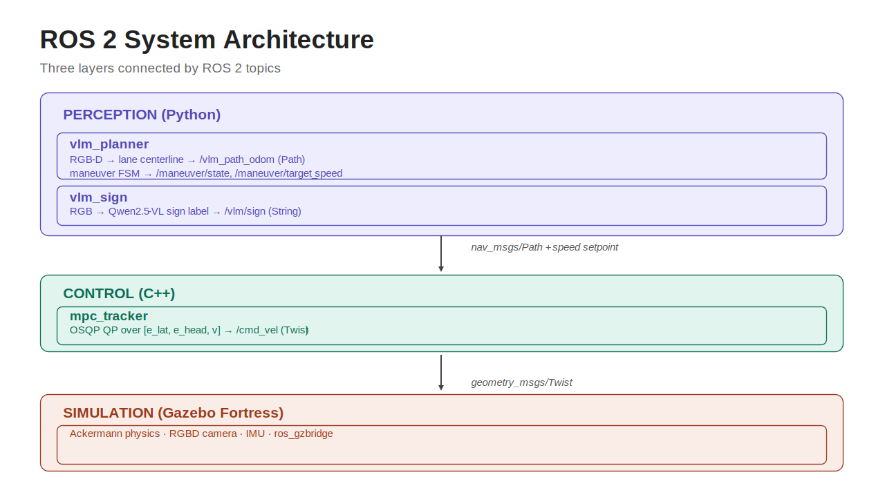

Two design decisions are worth calling out:

**Process-level decoupling of the VLM.** The sign reader (`vlm_sign`) and the planner (`vlm_planner`) are separate nodes under *different Python interpreters* — the VLM requires a virtual environment with PyTorch and NumPy 2, which is binary-incompatible with the ROS Humble `cv_bridge`; the planner runs on the system interpreter. All image conversion in the VLM path is therefore cv_bridge-free (direct `sensor_msgs/Image` ↔ NumPy codecs). The VLM queries on its own timer (0.5 Hz) in a dedicated callback group, so a 2 s inference can never stall the 5 Hz planning loop.

**Everything the controller sees is conventional.** The MPC subscribes to a `nav_msgs/Path`, an odometry topic, and two small runtime setpoints (target speed, maneuver state for lookahead scheduling). No VLM output touches the controller directly; the FSM mediates. An earlier design in which maneuvers reshaped the path itself (curvature-proportional inward bias, then a clothoid extrapolation) was implemented, evaluated, and **removed**: direction lives in the path produced by lane perception, and the maneuver layer sets only the speed regime.

State estimation sits alongside: an EKF (`robot_localization`) fuses wheel odometry velocities with a simulated noisy IMU to produce `/odom_ekf`, which both the planner and the controller consume, so path and pose share one frame (§7).

**Figure 3 — Node/topic graph of the full stack**

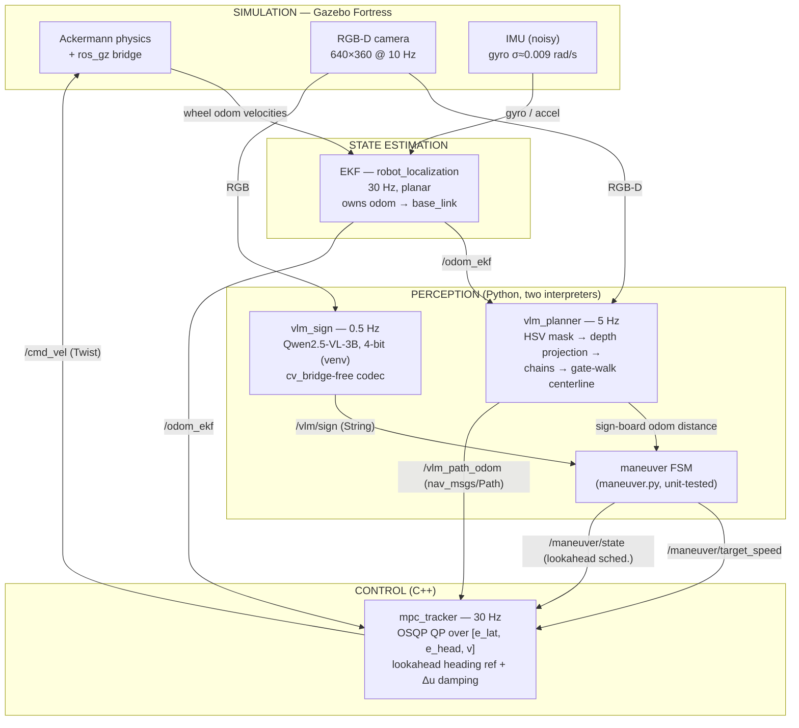

---

## 3. Vehicle Platform and Simulation Environment

**Vehicle.** The robot is a primitives-only URDF Ackermann car: wheelbase L = 0.32 m, track width 0.22 m, wheel radius 0.05 m, chassis mass 4.5 kg. Front wheels have a two-stage joint structure (revolute steering joint, ±0.55 rad, above a continuous spin joint); rear wheels are driven. Three Gazebo plugins are embedded in the URDF: `AckermannSteering` (consumes `/cmd_vel`, publishes drifting wheel odometry), an RGB-D camera (640×360 @ 10 Hz, with a proper optical-frame rotation for pixel projection), and a joint-state publisher. An `OdometryPublisher` plugin additionally exports drift-free ground truth (`/odom_truth`) for evaluation only — no control component consumes it.

**Worlds.** Perception development progressed through three generations of test worlds: a straight cone lane (0.8 m gate width), a parametric S-curve world (script-generated; amplitude, period, and lead-in/out lengths configurable), and the final **line-track world**: white painted lane boundaries on dark asphalt forming straights, turns, a winding section and a terminal U-turn (~11 m), with four single-sided traffic sign boards (left, right, winding, stop) and a red goal marker. Sign boards are gray-backed so they are legible only from the front, which eliminated cross-loop misreads on the doubling-back track.

**Figure 4 — (a) Robot coordinate system; (b) Top-down view of the line-track world.**

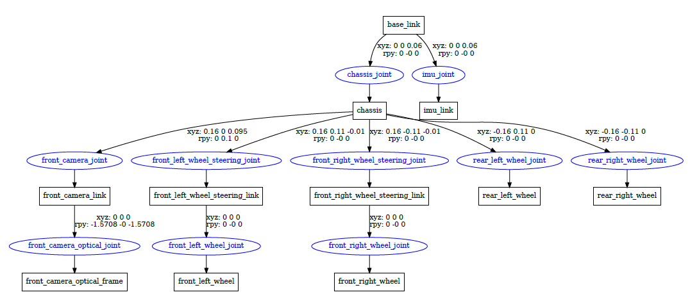
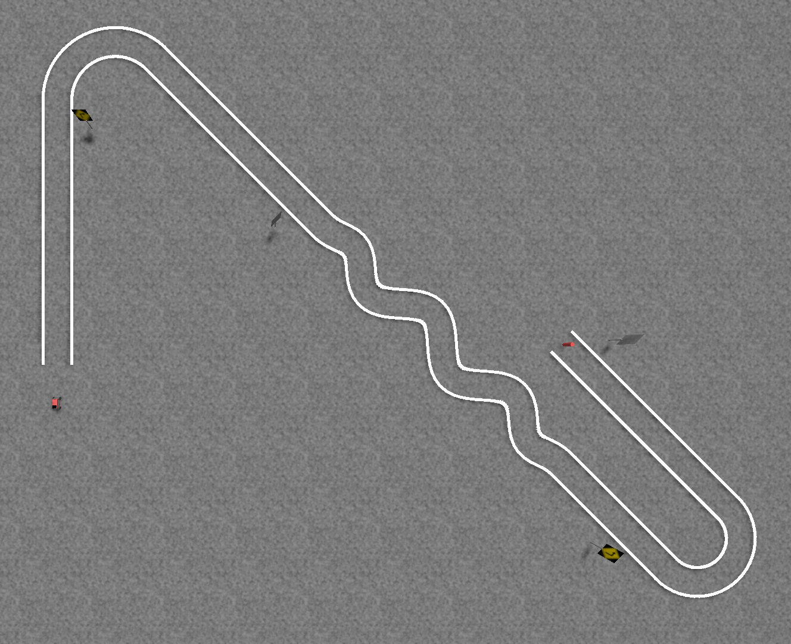

---

## 4. Geometric Perception: Metric Lane Centerline

The planner's job each tick (5 Hz) is: RGB-D frame → set of metric lane-boundary points in the robot frame → a single centerline → a smoothed, uniformly resampled `nav_msgs/Path` in the odometry frame.

### 4.1 Boundary detection and depth projection

Lane markings are segmented in HSV space (low saturation, high value against dark asphalt) with a minimum-area speckle gate (`area_min_px = 50`; see §4.4 for why this value matters). Sampled boundary pixels are projected to the `base_link` frame using the camera intrinsics and the *aligned depth image*, with two robustness measures: each point takes the **median depth over a 3×3 window** (a single-pixel read frequently lands on background between sparse features), and a height gate rejects points whose reconstructed z is implausible for a ground marking (this also keeps sign-board pixels out of the lane cloud). Points beyond a forward clip `d_max = 2.0 m` are discarded: long-range depth is noisy enough that distant markings, if retained, drag the centerline off the lane.

**Figure 5 — From camera image to lane boundary detection**

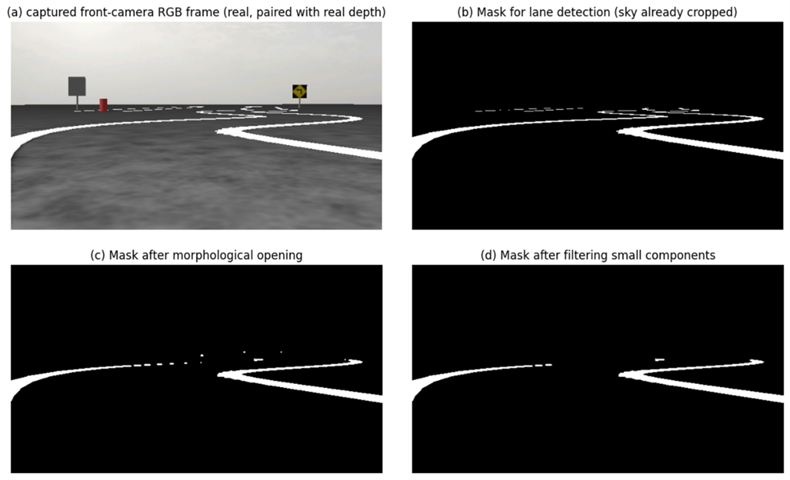

### 4.2 From point cloud to centerline

The projected cloud is grid-deduplicated and clustered into **chains** (ordered point sequences along a boundary) by nearest-neighbor linking; approximately collinear chains are merged. Chains are then classified left/right and the centerline is synthesized.

A persistent **side memory** carries left/right identity across frames, and a fold-back hold plus a fixed (0,0) anchor at the robot stabilize the near end of the path (an experiment that carried the anchor backward between frames *increased* oscillation in every variant tried and was abandoned — documented as a dead end).

**Figure 6 — From point cloud to centerline**

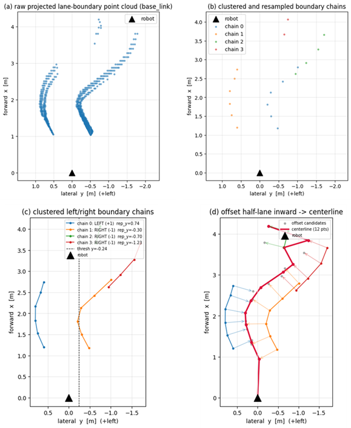

### 4.3 Smoothing without lag

Raising the planner rate exposed per-frame depth jitter as visible path oscillation. A temporal (cross-frame) low-pass was considered and **rejected**: on a curve the path genuinely changes each frame, so temporal filtering adds lag that makes the path trail the lane. Instead the pipeline uses **stateless within-frame smoothing** — a moving average (window 3) over the centerline points, with an optional polynomial fit y = f(x) retained behind a parameter as an A/B alternative — followed by uniform arc-length resampling. Fitting many points with few parameters averages noise with zero temporal state, and (unlike a moving average) a fit also smooths the near endpoint the controller steers toward.

---

## 5. Semantic Perception: VLM Sign Reading

### 5.1 Model selection (an empirical negative result first)

SmolVLM2-500M-Video-Instruct (~1 GB VRAM, ~2.6 s/frame) was evaluated first for both geometric and semantic tasks. It failed at geometry outright (no usable waypoints or lane descriptions) and failed at reading *word* signs; it could read *numeric* speed-limit signs. Qwen2.5-VL-3B-Instruct, 4-bit quantized (2.46 GB VRAM, ~2 s/frame on the RTX 3060), reads all four symbolic signs used here (left, right, winding, stop) correctly — in a ground-truth probe over the track's sign approaches it scored 5/5 with well-grounded `none` responses between signs. One property matters for system design: the model's self-reported confidence was a **constant 0.95** regardless of correctness, so confidence gating is useless; temporal consistency (k consecutive identical reads) is used instead.

### 5.2 Node design

The `vlm_sign` node subscribes only to the camera, queries the model on its own timer (0.5 Hz, adjustable via YAML), and publishes a plain label on `/vlm/sign` plus an annotated debug image. It never publishes a path. The prompt requests a strict JSON classification; a fail-safe parser maps anything unparseable to `none`. A live parameter allows disabling queries at runtime without killing the node.

### 5.3 Sign localization and the label latch

A label alone is not actionable — the same sign is visible for many frames and, on a doubling-back track, signs from *other* loops can enter the camera. Classical geometry closes the gap:

1. **Board localization.** The sign board is detected geometrically and projected to the odometry frame; the planner tracks the signed along-track distance to the board.
2. **Validity band.** A label is accepted only while its board is 3.6–8.0 m ahead (below the near edge the board fills the frame or clips the region of interest; beyond the far edge left/right are confused at distance).
3. **Label lock.** At 3.5 m the label, the board identity, and the image region of interest are *frozen* — the board typically leaves the field of view during the final approach, and the lock preserves the association until the board passes.
4. **Per-label commit distance.** The distance at which the maneuver arms differs by label (left/right/stop: 1.5 m; winding: 4.0 m — a winding regime must begin before the first bend, whereas a turn begins at the sign).

This configuration was frozen after the validation campaign of §10 and is treated as approved; re-tuning requires new evidence.

**Figure 7 — FPV frame with the annotated sign readout (label, distance, lock state) during a right-turn approach**

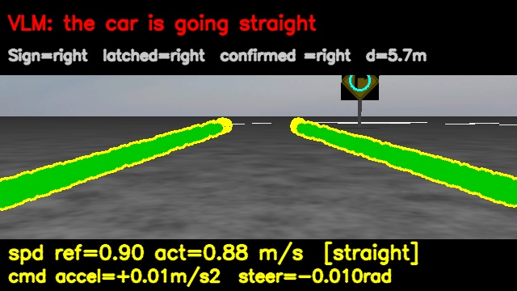
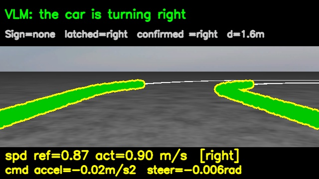


---

## 6. The Maneuver State Machine

The FSM (`maneuver.py`, pure Python, ROS-free, unit-tested) converts sign events into a committed maneuver state: `straight` (default), `left`, `right`, `winding`, `stop`. Its two inputs are kept strictly separate.

**Entry — the sign-passed edge.** While a validated label's board is ahead and within reach, the maneuver is *armed*; it *commits* on the single frame the board transitions from ahead to behind the robot. Using this edge (rather than "label present and close") guarantees the commit fires exactly once — a board sits *before* its turn and remains marginally ahead for many frames, so any level-triggered rule would re-commit continuously. A newly passed sign **preempts** the current maneuver: consecutive maneuvers can abut with no straight section between them (e.g., winding immediately after a right turn), in which case the straight-road exit would never fire for the first maneuver.

**Exit — distance-debounced straightness with hysteresis.** Straightness is measured on the *lane centerline geometry* (summed |Δheading| along the planned path in the robot frame). Two subtleties make the naive rule ("release when the path is straight") fail:

- The *approach* to a turn is already straight, so a maneuver must first **engage** (path bend exceeds 0.35 rad) before a straight path (< 0.20 rad) is allowed to release it.
- A winding road is locally straight at each inflection, so a frame-count debounce false-releases mid-winding. The release instead requires **2.0 m of continuously straight travelled distance** (odometry-integrated; any bent frame resets the accumulator; odometry jumps during lane dropouts are clamped so a dropout cannot masquerade as a straight stretch). A distance criterion is also speed- and rate-independent where a frame count is not.

Synthetic paths (the creep path published when no lane is visible and the one-pose halt path) are straight by construction and are **never** fed to the exit detector — otherwise losing the lane mid-turn would falsely release the maneuver. An engaged maneuver therefore correctly persists through brief perception dropouts.

**Action mapping.** The FSM state drives two runtime setpoints, published every planning tick:

| state | target speed (m/s) | MPC heading lookahead (m) |
|---|---|---|
| straight / none | 0.9 | 2.0 |
| left / right | 0.6 | 0.3 |
| winding | 0.6 | 0.5 |
| stop | 0.0 | (turn value) |

Both are consumed by the controller as *topics*, not parameters (the controller reads parameters once at startup), and both carry a freshness fail-safe: a stale or missing setpoint holds the current value and can never command an acceleration on a dead planner.

---

## 7. State Estimation

Wheel odometry from the Ackermann plugin is open-loop dead reckoning and drifts, worst in turns (heading error dominates). An EKF (`robot_localization`, 30 Hz) fuses the wheel odometry's body-frame velocities with a simulated noisy IMU (gyro σ ≈ 0.009 rad/s, accel σ ≈ 0.08 m/s²) in planar mode; fusing the unbiased gyro corrects heading, the dominant drift source. The EKF output `/odom_ekf` owns the `odom → base_link` transform and is the single localization source for planner and controller — the system is deliberately drift-*tolerant* rather than drift-free, since the path is regenerated from live perception every 200 ms and only short-horizon frame consistency matters. Ground truth is retained solely for evaluation (frame-to-frame EKF jitter measured at 0.2 cm position, 0.005° yaw — exonerating the estimator during the oscillation investigation of §8.5).

**Figure 8 — RViz trajectory comparison: wheel odometry (red), EKF (blue), ground truth (green)**

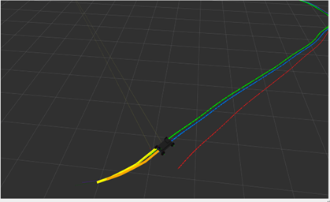

---

## 8. Model Predictive Control

### 8.1 Vehicle model

The controller uses the kinematic bicycle model with state $[x, y, \psi, v]$ and control $u = [a, \delta]$ (longitudinal acceleration, front steering angle):

$$
x_{k+1} = x_k + v_k \cos\psi_k \,\Delta t,\qquad
y_{k+1} = y_k + v_k \sin\psi_k \,\Delta t,
$$
$$
\psi_{k+1} = \psi_k + \frac{v_k}{L}\tan\delta_k \,\Delta t,\qquad
v_{k+1} = \mathrm{clamp}(v_k + a_k \Delta t,\; 0,\; v_{max}),
$$

with wheelbase L = 0.32 m. Control limits are asymmetric in acceleration (braking authority 1.8 m/s² vs. 1.2 m/s² acceleration) and δ ∈ ±0.5 rad.

### 8.2 Error state and linearization

Rather than tracking absolute poses, the QP operates on a tracking-error state per horizon step, $s_k = [e_{lat}, e_{head}, v]_k$: signed cross-track error in the path frame, heading error against the path reference, and absolute speed. The error dynamics are linearized to $s_{k+1} = A_k s_k + B_k u_k + c_k$. A subtle but consequential choice is the **linearization speed**: the velocity–heading coupling terms are linearized around the *current measured speed* $v_{lin} = \mathrm{clamp}(v_0, 0, v_{max})$, **not** the target speed. The target belongs in the cost (as the setpoint); using it as the operating point conflates two roles and makes the internal model inconsistent with the plant exactly during speed transients — producing sluggish correction on turn exit ($v_{ref} > v$) and overshoot on turn entry ($v_{ref} < v$). At steady state the two coincide and the change is a no-op.

### 8.3 QP formulation

With horizon N = 15 and dt = 0.1 s, decision vector $z = [s_0 \dots s_N, u_0 \dots u_{N-1}]$:

$$
\min_z\; \tfrac12 \sum_{k} \Big[ w_{lat} e_{lat,k}^2 + w_{head} e_{head,k}^2 + w_{v} (v_k - v_{ref})^2 + w_a a_k^2 + w_\delta \delta_k^2 \Big] \;+\; \tfrac12\sum_k \Big[ w_{\Delta a} \Delta a_k^2 + w_{\Delta\delta} \Delta\delta_k^2 \Big]
$$

subject to the linearized dynamics as equality constraints, the initial state pinned to the measured $[e_{lat,0}, e_{head,0}, v_0]$, box bounds on speed $[0, v_{max}]$ and on both controls. The speed target enters through the linear term ($q_v = -w_v v_{ref}$, completing the square). The Δu terms include the **boundary term $(u_0 - u_{prev})^2$** against the *previously applied* command — see §8.5. The problem is assembled sparsely (triplet form; OSQP consumes the upper triangle) and solved with OSQP via osqp-eigen at the 30 Hz control rate, warm-started. Only the first control is applied (receding horizon); the predicted trajectory published for visualization is the *nonlinear* rollout of the full optimized control sequence.

**Fallback.** The pre-QP stand-in — a single-step proportional law on the same error state, with gains formed from the cost-weight ratios ($k_{lat} = w_{lat}/w_\delta$, etc.) — is retained verbatim as a safety net. Any OSQP initialization or convergence failure returns the proportional command instead; the node logs the active control source on every transition and warns (throttled) while degraded. The vehicle is never left without a command.

### 8.4 Reference conditioning: the lookahead heading

The heading reference $\psi_{ref,k}$ is **not** the local path tangent at the reference point (a ~10 cm baseline that inherits every centimeter of perception noise) but the **bearing to a point a lookahead distance ahead** on the path — a long baseline that averages centerline noise and previews upcoming curvature; the curvature feed-forward inherits the same de-noising. The lookahead is **maneuver-scheduled** at runtime by the FSM state (2.0 m on straights for maximal noise averaging; 0.3–0.5 m in turns, because the chord to a far lookahead point cuts inside a curve by ≈ L²/2R).

### 8.5 The noisy-reference limit cycle (diagnosis and fix)

The single most instructive control problem in the project was a persistent steering oscillation on straights. Recorded-session analysis with ground truth localized the cause: seed reference jitter was only ~1 cm and originated in *detection* (the EKF was exonerated, §7), but the controller **amplified it ~12×** into a 17 cm peak-to-peak swing with steering near saturation — a closed-loop limit cycle, with heading gain saturating the steering limit on noise, not a perception or estimation failure. The visible "shifting path" was mostly a consequence (the path is re-anchored to a swinging robot), not the cause.

The cure is the combination of §8.4 with the **Δu cost including the $(u_0 - u_{prev})^2$ boundary term** (before this, the previous command entered the solver interface but was ignored), plus a rebalanced heading gain. In a closed-loop probe on a straight with 1.5 cm injected reference noise, steering-command standard deviation dropped **11.5×** (0.111 → 0.0096 rad) and lateral deviation 3.6×.

### 8.6 Speed setpoint injection

The maneuver speed setpoint is slew-rate-limited in the node before injection into the solver, with **asymmetric** rates: slow ramp-up (a turn→straight regime switch glides rather than lurching) and fast ramp-down (a stop or slow-down command is never rate-limited into a hazard). The limiter also keeps $v_{ref}$ near the actual speed, which protects the §8.2 linearization. The direct halt path (§4.5) bypasses the limiter entirely.

**Figure 9 — Steering command and lateral error on a straight segment**

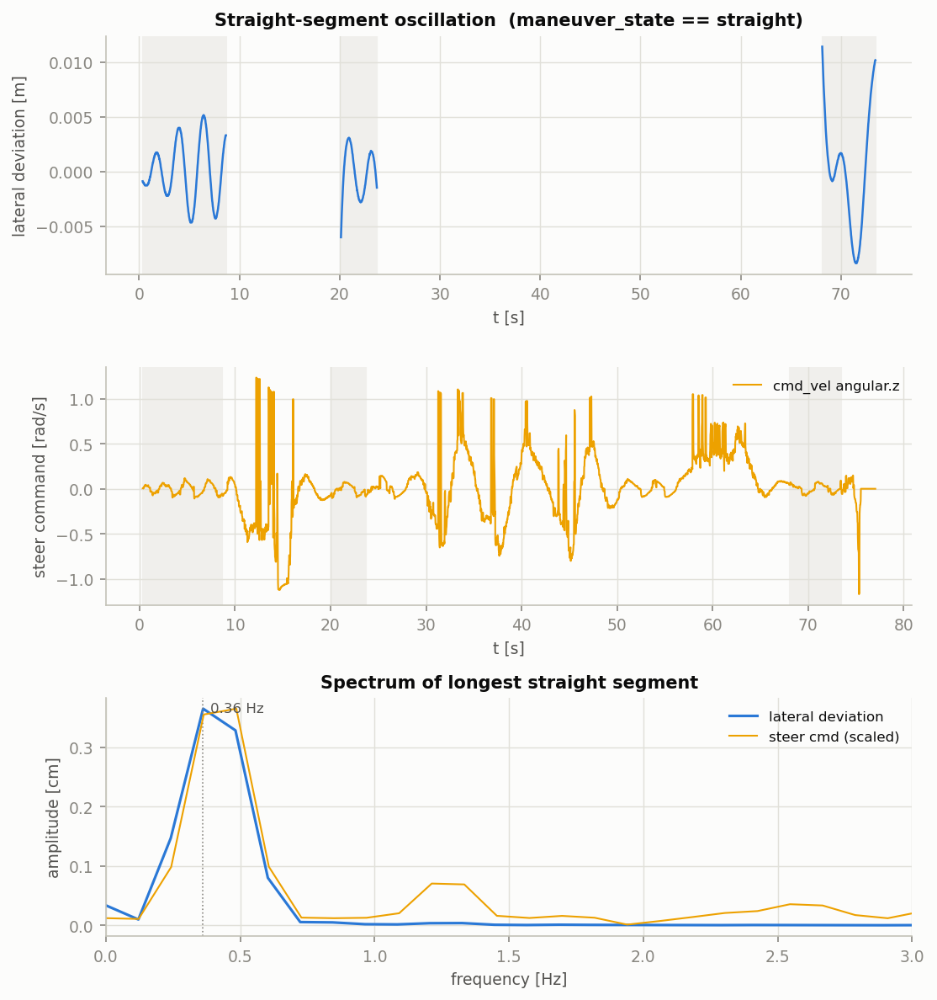

**Figure 10 — Speed tracking over the full course: maneuver setpoint (step), slew-limited reference (ramp), and actual speed**

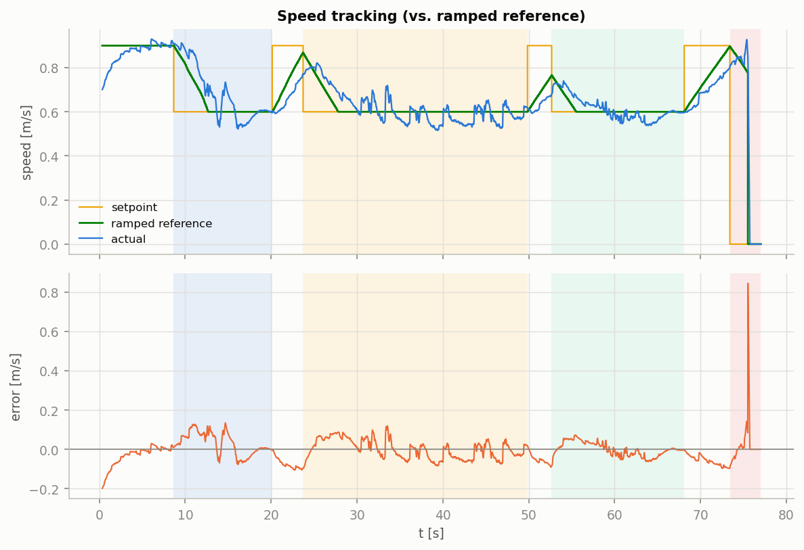

---

## 9. Test and Analyze Infrastructure

The project built a layered, fully headless testing and tuning toolchain (`tools/debugkit/`, plain Python + NumPy, no simulation-side dependencies):

**Figure 11 — Validation pipeline diagram (bring-up → record → analyze → reports).**

```
sim running ──> record_session.sh ──> data/sessions/<stamp>_<label>/
                                                │
                analyze_session.sh latest <─────┘
                        │
                        └──> <session>/analysis/  report.md + metrics.json + *.png
```

**Recording:** `record_session.py` subscribes to a configurable topic set, organized as presets in `topics.yaml` (**Core** − Odometry, IMU, commands, setpoint, maneuver state, sign; **Paths** – planner/reference/predicted path snapshot; **Images** – camera frames, depth info, debug image overlay; **VLM** – VLM sign recognition intermediates; **Debug** – Node internal taps). Each run writes a self-contained session directory: per-signal CSVs, timestamp-indexed path and image snapshots, and a `meta.yaml` recording the git commit, preset, and free-text notes. Every row carries both message's header stamp and the recorder's receive time on a shared sim-time epoch, so any signal can be aligned.

**Analysis:** `analyze_session.py` computes a fixed metric suite from a recorded session: an XY trajectory overview; odometry drift against ground truth (position/yaw error, RMSE, percent of distance); straight-line lateral oscillation (signed deviation from a PCA line fit – std, peak to peak, dominant frequency via FFT) alongside steering-command activity and its spectrum; VLM sign read-to-maneuver-engagement; speed tracking error against the command setpoint; and cross-track error against the active planner path. Each analysis renders a PNG plot. Results land in `<session>/analysis/` as a human readable `report.md` and a machine-readable `metrics.json`. Analysis whose input signals weren't recorded are skipped with a note rather than failing the run.

**Node-internal debug taps:** Values that live inside a node – the centerline builder's chain/classification stages, side-memory state, frame rejection – never reach a topic. A lightweight `DebugTap` helper lets a node publish its per-tick internals as one JSON string on `/debug/<node>`. The recorder stores these timestamp-synced with other signals. `plot_tap.py` renders them ad hoc for symptom-specific digging. A companion lane-cloud dump captures full per-frame point clouds for the planner so a specific bad frame can be replayed offline through every centerline stage.


---

## 10. Results

All results below are from the most recently recorded and analyzed simulation session, `20260720_182332_demo1` (commit `57abd6d`; `scripts/analyze_session.sh latest`, full preset, right turn → winding section → terminal U-turn → sign-commanded stop course).

**Course**: 50.71 m driven in 76.9 s (pose source `odom_truth`), 21 actionable sign reads, ending in a clean halt at the goal.

**Odometry drift**: `odom` vs. ground truth: RMSE 1.303 m, final 1.456 m (2.87% of distance), yaw RMSE 3.66°. `odom_ekf` vs. ground truth: RMSE 0.176 m, final 0.176 m (0.35% of distance), yaw RMSE 0.00°.

**Oscillation on straights**: Three straight segments observed: lateral std 0.2–0.5 cm, peak-to-peak 0.9–2.0 cm, dominant frequency 0.19–0.36 Hz.

**Sign detection & maneuver engagement**: 26 raw sign-read transitions (message counts: left 25, none 33, right 17, stop 9, winding 7); all four committed maneuvers (right, winding, left/U-turn, stop) engaged with correct timing (`planner_tap` outcome counts: published 1295, halt goal 39, hold last path 7 — no stalled ticks).

**Speed setpoint tracking:** Actual speed vs. the slew-limited reference the QP actually chases (`/mpc/v_ref_ramped`), not the raw stepwise setpoint: RMSE 0.054 m/s, mean −0.009 m/s, max error 0.845 m/s (while the ramped reference > 0.05 m/s; the max-error spike is the terminal stop, where actual speed is still ramping down as the reference has already reached zero).

**Path tracking (cross-track):** Distance from `odom_ekf` to the active planner path: RMSE 0.018 m, mean 0.013 m, max 0.105 m (419 snapshots).

**Figure 12 — Full-course trajectory: ground-truth path over the track map, with armed sign read by VLM marked**

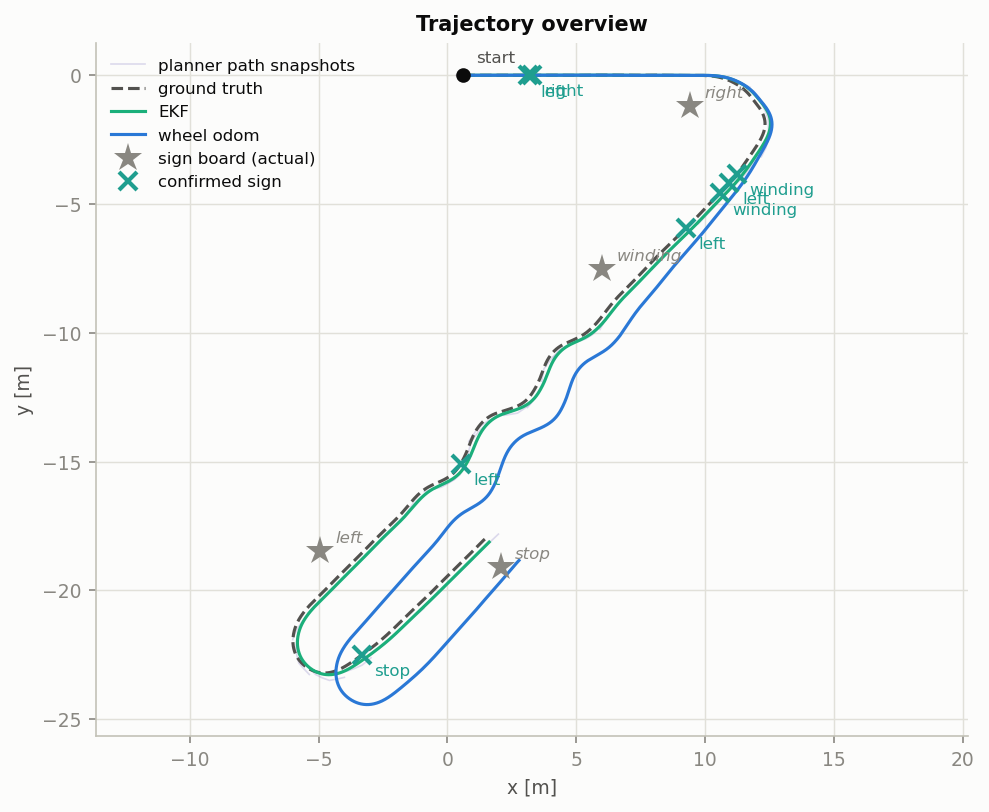

**Figure 13 — Lateral error time series over the full course with maneuver-state bands**

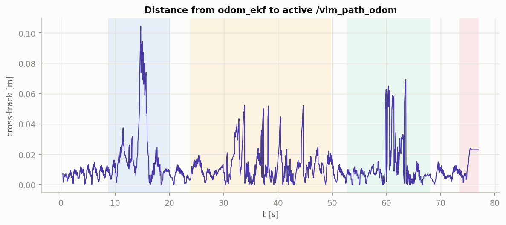

---

## 11. Discussion and Lessons Learned

**Use the VLM for what only the VLM can do.** Every attempt to extract *geometry* from a small VLM failed or underperformed a classical baseline; every *symbolic* task within the model's competence (word/symbol signs for the 3B model, numeric signs even for the 500M model) worked. The architecture that resulted — VLM emits a label, classical geometry decides where and when it applies, an FSM decides what it means over time — kept the unreliable component maximally sandboxed: a wrong label can select a wrong speed regime, but it cannot bend the path or bypass the physical stop behavior.

**Edges, latches, and distances beat levels, frames, and confidence.** Three independent subsystems converged on the same pattern: the sign label latch (freeze identity before the sensor loses the target), the maneuver entry (commit on a transition edge, not a level), and the maneuver exit (debounce by travelled distance, not frame count). Each replaced a level/frame/confidence-triggered design that failed in a specific, reproducible way. Notably, the VLM's constant self-reported confidence made confidence gating strictly useless — temporal consistency is the only usable signal.

**Oscillation was a *control* problem wearing a *perception* costume.** The instinctive responses to path wobble — filter the path harder, distrust the estimator, retune detection — were all wrong; ground-truth instrumented recording showed centimeter noise amplified 12× by the loop. The durable fixes (long-baseline heading reference, Δu penalty against the applied command) live entirely in the controller. The general lesson: before filtering a signal, measure where the gain is.

**Deleting is a feature.** Two full implementations of maneuver-driven path shaping (inward bias; clothoid extrapolation) were built, evaluated, and removed when they underperformed the plain centerline — the bias latched on off-center starts, and the clothoid added complexity without measurable tracking benefit at these speeds. The final "turns set speed only, direction lives in the path" design is simpler than either.

**Faithful stand-ins pay compound interest.** The pre-QP proportional controller was deliberately built on the *same error state and weights* as the eventual QP. This validated the entire error pipeline months before the solver existed, made the swap to OSQP purely internal, and then survived as the fallback layer of a never-command-less safety design.

**Test infrastructure was the enabling investment.** The headless record–analyze–validate loop converted tuning from an interactive activity into an unattended one (12 overnight loops), and offline replay converted perception A/B tests from minutes of simulation into seconds. Roughly half of the campaign's fixes were found by the analyzer's metrics rather than by watching the robot.

---

## 12. Limitations and Future Work

- **Cornering under the real QP is unvalidated.** The proportional-era tuning transferred imperfectly; the 2026-07-10 run identified hot turn entry (0.53 m wide), degraded single-boundary path geometry at the apex, and an end-of-path stop deadlock as the open defect cluster. Fixes are specified and awaiting review.
- **Detection-timing coupling in maneuver commit.** The FSM commits the label armed when the board passes; at 0.5 Hz query rate a late VLM read can commit a stale label when signs are closely spaced. This is a sensing-rate limit, not a state-machine defect; mitigations are a higher query rate near boards or committing at a positive trigger distance.
- **Simulation only.** No sensor-realistic camera artifacts (exposure, motion blur), no real depth noise model, no latency variation beyond the schedulers'. The debugkit session format is source-agnostic by design, so a rosbag-from-vehicle converter is the intended on-ramp to real-platform data.
- **Perception horizon.** The 2.0 m forward clip that stabilizes the centerline also bounds preview; the MPC's lookahead cannot see past it. A windowed-median depth projection over skeleton-ordered polylines (designed, not implemented) would extend usable range.
- **Scale-up (v2).** A follow-on effort targets an urban, full-size-vehicle scenario (traffic lights, multi-block missions) on a separate branch, reusing the layer boundaries established here; it has reached a first sim-proven implementation and is outside the scope of this report.

---

## 13. Conclusion

This project demonstrates a complete, quantitatively validated autonomy stack on commodity hardware in which a vision-language model is a *component with a job description* — reading signs — rather than an end-to-end policy. The load-bearing engineering is classical and inspectable: metric perception with explicit robustness layers, a small state machine whose every transition rule is traceable to a failure it prevents, a sparse QP with carefully conditioned references, and a fail-safe chain (setpoint freshness → slew limiting → proportional fallback → active halt) at every layer boundary. The accompanying scenario-based validation toolchain turned tuning into a measurable, repeatable, and partially unattended process, and is the part of the work most directly transferable to other robotics projects.
